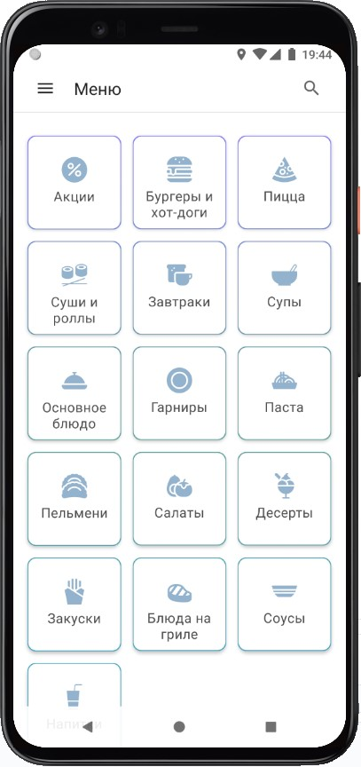
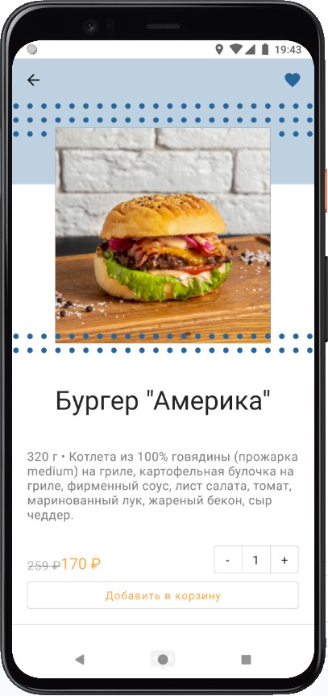

# YammyDelivery

YammyDelivery - food delivery app for learning purposes.

#### The last updated branch is koin-ktor-sqldelight.

Architecture:
 * Multi-module,
 * MVVM + MVI/Redux principles (UDF, common state)

Tech stack:
 * Jetpack Compose,
 * Coroutines and Kotlin Flow,
 * Dagger Hilt,
 * Room,
 * Navigation Component,
 * Retrofit,
 * Google Maps,
 * Firebase Cloud Messaging

Navigation drawer screen.

Menu screen.

Dish category screen.

Dish details screen.

