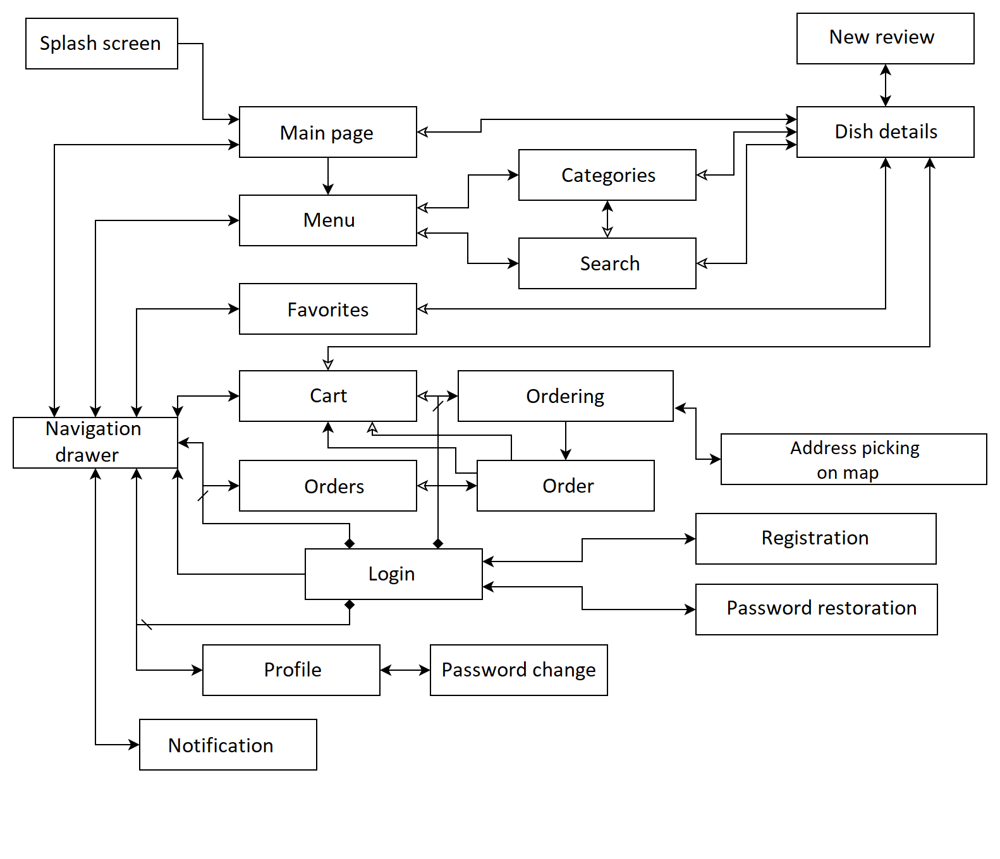
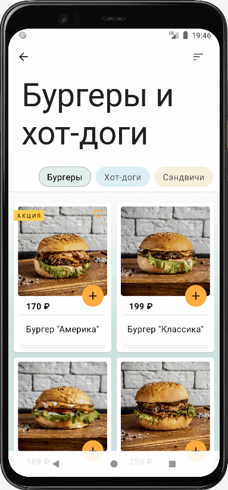

# YammyDelivery

YammyDelivery - a food delivery application for learning purposes and technology playground.

The last updated branch is koin-ktor-sqldelight.

## Architecture:

* Multi-module,
* MVVM

## Tech stack:

#### *Branch 1 – master:*

* Jetpack Compose,
* Coroutines and Kotlin Flow,
* Dagger Hilt,
* Room,
* Datastore
* Navigation Component,
* Retrofit,
* Google Maps,
* Firebase Cloud Messaging

#### *Branch 2 – koin-ktor-sqldelight:*

Difference with branch 1

* Koin (instead of Dagger Hilt),
* SQLDelight (instead of Room),
* Ktor (instead of Retrofit)

#### *Branch 3 – compose-fragments:*

Stale branch that launches Jetpack Compose functions in fragments. Tech stack is similar to branch

1.

## Scheme

## Some screens and functionality

Splash screen with lottie animation. During this time the data is updated.

Main screen.

Menu screen and screen that shows dishes of a specific category or subcategory.

Dish details screen, reviews, adding review.

Search screen. The search is carried out by the names of categories, subcategories and dishes. The
selected query is cached.

Login process, conditional navigation. When navigating to the screen that requires authorization,
the login screen opens. After successful authorization, the required screen opens.

Ordering process, picking address on the map and returning result back.

Receiving notifications via Firebase Cloud Messaging. Navigating to notification screen when the app
is opened and the app is closed. New notifications are marked with indicator which disappears after
1 second after being seen.

